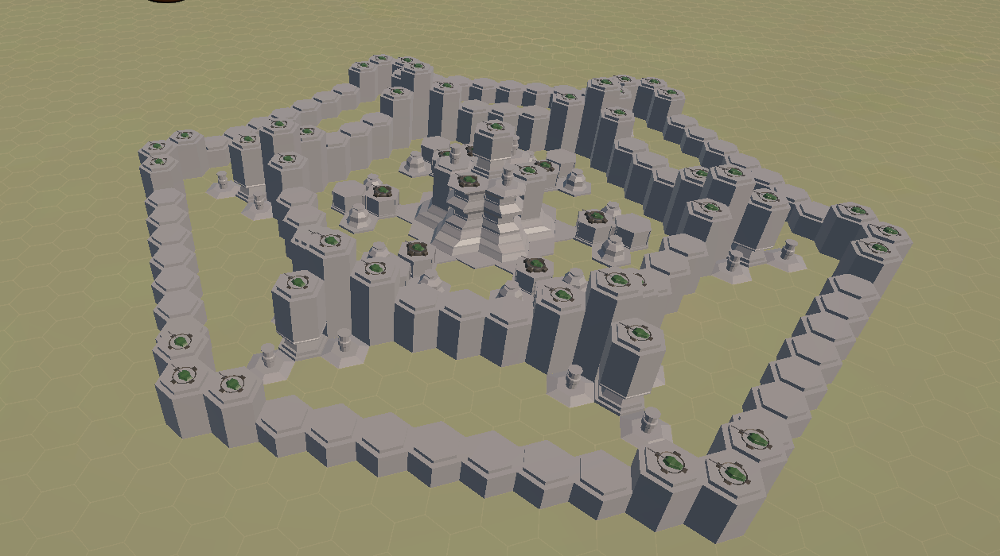
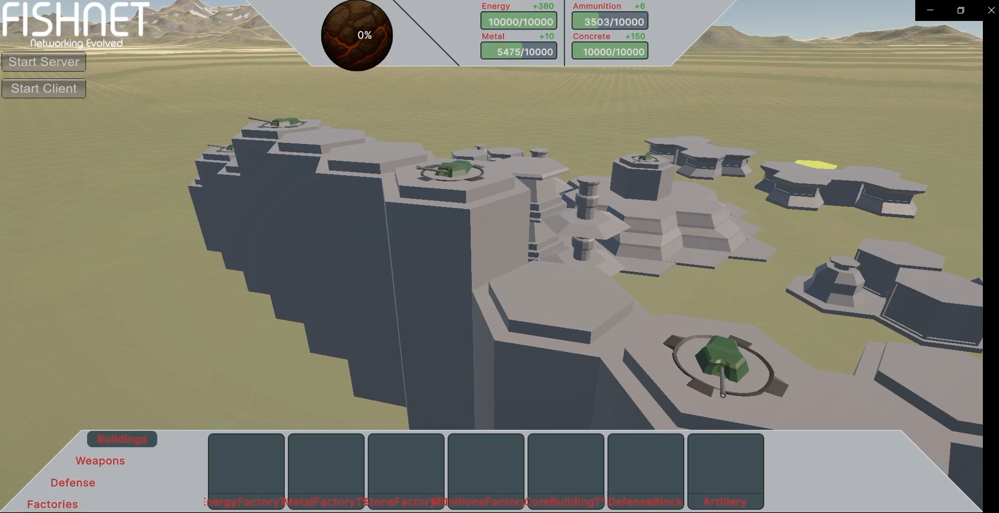
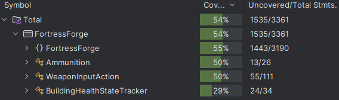

# PM4-FS25-FortressForge

Fortress Forge is a strategy game where players build, manage resources, and compete on hex-based maps. The project is developed in C# using Unity, with a modular codebase and clear coding guidelines.

Game Screenshots:

---

## Team Members 🧑‍💻

- Esposito Diego
- Geisser Fabio
- Hofer Levin
- Kryeziu Leona
- Wyss Julien
- Zürcher Patrick

---

## Table of Contents

- [Key Features](#key-features)
- [How to Start Development](#how-to-start-development)
    - [Prerequisites](#prerequisites)
    - [Clone the Repository](#clone-the-repository)
    - [Open with Unity](#open-with-unity)
- [Testing & Quality Metrics](#testing-and-quality-metrics)
    - [Static Code Analysis](#static-code-analysis)
    - [Code Coverage](#code-coverage)
- [Testing Concept](#testing-concept)
- [Change Log](#change-log)
- [Development](#development)
- [Coding Guidelines](#code-guidelines)
- [Project Wiki](#project-wiki)
- [License](#license)

---

## Key Features

- **Game Initialization**: Host can select available buildings, technologies, and the map.
- **HexGrid System**: Each player has one or more HexGrids.
- **Team Support**: Teams are supported in the backend.
- **Resource Management**: Buildings affect resources over time.
- **Modular Building System**: Easily add new buildings and technologies.

---

## How to Start Development

Follow these steps to get up and running with the project.

### Prerequisites

•⁠  ⁠*Unity Editor*: [Download Unity Hub](https://unity.com/download) and install the correct Unity version:
- 🔧 *Version:* ⁠ Unity 6000.0.37f1 ⁠
  •⁠  ⁠(Optional) *Rider* or any C# IDE with Unity support

###  Clone the Repository

⁠ bash
git clone https://github.com/PM4-FS25-FortressForge/PM4-FS25-FortressForge.git
 ⁠

### Open with Unity

•⁠  ⁠Open Unity Hub
- Navigate to Add -> Add project from disk
- Navigate to your clones Repository
- *Important:* Make sure to select the ⁠ FortressForge/ ⁠ subfolder (not the root of the repository)
    - This is the actual Unity project folder

Now you can start your installation with Unity.

---
## Testing Concept

## Overview

The goal of this testing concept is to ensure a bug-free and user-friendly experience in **FortressForge**. To achieve this, we use a combination of **automated** and **manual** testing methods, prioritizing key areas that impact the overall functionality of the game.

### Testing Approach

Due to the complexity introduced by **Unity** and **FishNet**, we do **not aim for 100% test coverage**. Instead, we take a pragmatic approach based on the following considerations:

### Why We Don't Aim for Full Coverage

- **Covered by Frameworks**: Many lower-level behaviors are already handled by Unity or FishNet.
- **High Complexity**: Some areas are too complex to test given the project's timeframe and learning curve.
- **Difficult to Automate**: Features like multiplayer synchronization across multiple clients and servers are not easily automatable with our current resources.
- **Obvious Failures**: Some critical errors would be immediately noticeable during normal gameplay (e.g., core startup issues).

### What We Prioritize

- **Automated Tests**: Where feasible, we use automated testing to cover reusable logic and to assist in future refactoring.
- **Manual Testing**: Complex or highly integrated systems (e.g., UI behavior, performance, multiplayer sync) are tested manually through active gameplay.

### Summary

We believe this balanced testing strategy ensures stability and playability without overwhelming the team with unrealistic testing demands. As the game's logic evolves, our testing depth and coverage will grow accordingly.

## Static Code Analysis
We use Sonarqube to perform static code analysis. It checks for code quality and style issues. Reports are available in [location or CI logs, or tool dashboard].

## Code Coverage
Test coverage is currently at **54%**, as shown below:

This coverage report shows which parts of the codebase are covered by automated tests. 
Next step would be to continuously improve this metric to ensure better test reliability and robustness.

## Detailed Testing concept
See [Test Konzept FortressForge](ProjectDocumentationFiles/Test Konzept FortressForge.docx) for a detailed description of our testing concept.

---

## Change Log

- 07.06.2025: Weapon Controls
- 27.05.2025: Magma Resource
- 20.05.2025: Lobby to GameView to Lobby connection
- 16.04.2025: Game Initializer
- 12.04.2025: Multi Block Build
- 03.04.2025: Building System
- 31.03.2025: Economy Logic
- 24.03.2025: Hexgrid
- 20.03.2025: GitHub Actions, SonarQube
- 20.03.2025: Camera Implementation

---

## Development

### Scrum Rules and Descriptions

What is Scrum?

* Scrum is an agile framework that helps teams solve complex problems by focusing on continuous improvement, based on the principles of transparency, inspection, and adaptation.

### Task Structure

* **User Story**: A user story is a short description of a feature written from the user's perspective. It describes what the user can do and why.

  * **Acceptance Criteria**: The acceptance criteria are the conditions that must be met for the user story to be considered complete.
* **Task**: A task is a piece of work that needs to be done to complete the user story.

A user story is broken down into tasks by the developer(s). Each task is worked on by a single developer and is merged into the `main` branch once completed (even if the user story as a whole is not yet finished).

### Sprint

* **Duration**: 2 weeks
* **Sprint Planning**: At the beginning of the sprint, a Sprint Planning meeting is held where the user stories to be worked on during the sprint are selected.
* **Daily Standup**: Several times a week, a standup meeting is held where each developer shares what they worked on recently, what they will work on today, and if there are any blockers.
* **Sprint Review**: At the end of the sprint, a Sprint Review meeting is held to present the completed user stories.
* **Sprint Retrospective**: At the end of the sprint, a Sprint Retrospective meeting is held where the team discusses what went well, what didn’t go well, and what can be improved.

---

## Coding Guidelines

Please follow our coding guidelines to ensure code quality and consistency across the project.  
[Guidelines](CodingGuidelines.md)

---

## Project Wiki

For detailed documentation, guides, and additional resources, visit the [Project Wiki](https://pm4-fs25-fortressforge.github.io/PM4-FS25-FortressForge/).

---

## License

This project is licensed under the MIT License. See the [LICENSE](LICENSE) file for more details.

